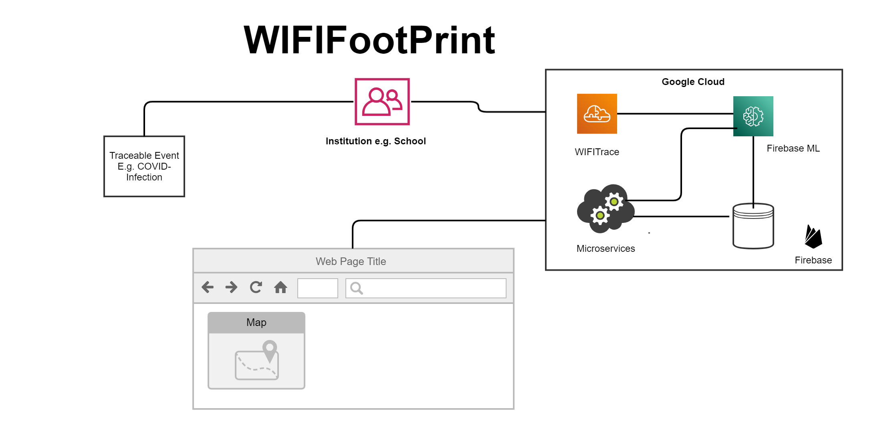

# WiFiFootprint
__Problem:__
Students on campus are worried about their safety while attending facilities on campus due to the uncertainty of where students that were tested positive for a virus have been.

__Solution:__
Wifi tracing app to alert students to avoid areas where positive cases have been.

__Technology Used:__
* Google cloud
   * [Firebase hosting](https://firebase.google.com/products/hosting)
   * [Google Map Platforms](https://developers.google.com/maps/documentation)

__Planned Integration:__
- [Firebase ML](https://firebase.google.com/products/ml)
- [Cloud Functions for Firebase](https://firebase.google.com/docs/functions)
- [Firebase Realtime Database](https://firebase.google.com/products/realtime-database)
- [WIFITrace](https://wifitrace.github.io/)

__LIVE DEMO:__
https://wififootprint.web.app/

- __NOTE__: The locations on the map are only added for demo. The locations are not real COVID-19 hotzones.
- Heat map is generated using 50 randomly selected router geo-locations around Cambridge, MA.

__Building for Digital Health__
MIT Hackathon 2021